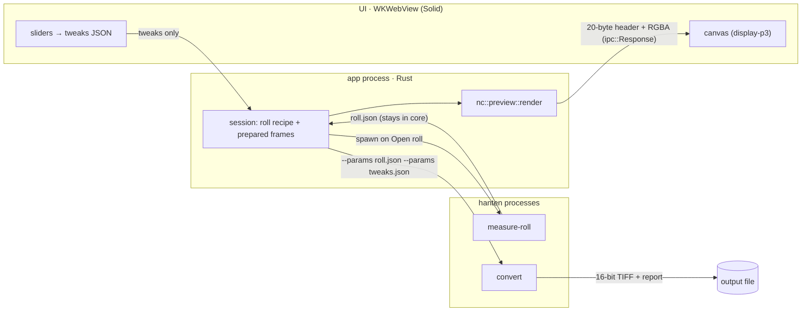

# Native App Prototype Spike

**Status:** closed. A throwaway Tauri prototype tested the desktop app's data flow;
**the code was not kept**, and this file is the record. The interactive checks
(slider feel, canvas colour space, the IR outline on screen) were never run: the first
hands-on attempt opened a Google Drive roll that was only partly downloaded.

**Investigated:** 2026-10-01 · branch `spike/native-app-prototype` from `c602ecb` ·
release build, rustc 1.99.0 · Apple M4 Pro (14 cores) · Tauri 2.12.1, Solid, WKWebView

## Question

Does the data flow planned for a desktop app hold up, and what unknowns does it turn up?
The planned flow: the core owns the roll recipe; the UI sends only tweaks; previews
render in the app's process from a cached, downsampled scan; export runs `hanten
convert` as a separate process. Crop, rotate, HDR preview, undo and packaging were
left out on purpose.

## The data flow as built

## Findings

### Confirmed

- **A factor-1 preview equals the export.** The in-app preview was compared with the
  file `hanten convert --params roll --params tweaks` wrote. With both quantized to 8
  bits, all 49,294,635 samples were equal. So the in-process preview and the
  separate-process export agree. At a larger factor the preview is, by construction,
  `convert` of the box-averaged scan, because every stage after decode works per pixel.
- **Preview cost per knob change** (`2026-09-13-Portra400/1675.tif`, 4927×3335):

  | `max_edge` | factor | preview | render |
  |---|---|---|---|
  | 1024 | 5 | 985×667 | 9–13 ms |
  | 2048 | 3 | 1642×1111 | 24–35 ms |
  | 3000 | 2 | 2463×1667 | 52–60 ms |

  Prepare (decode + base + area + downsample) took 28–72 ms on a warm cache.
- **Export is fast.** `convert` at full resolution with two `--params` layers took
  0.33 s; `measure-roll` on base, leader and 3 frames took 0.73 s (warm cache).
- **The library split costs little.** The root crate's CI gates passed with it, with
  the doc-gate exception in unknown 2.

### Unknowns the prototype surfaced

1. **The stage boundary types are deliberately crate-private.** `AcesCgImage` can't be
   cloned or built outside its mapper, and `DisplayReferredImage::into_parts` is
   `pub(crate)`. So the preview has to live **inside `nc`**, with the app as a thin
   caller. A library target alone is not enough. The cache point became the
   downsampled *scan*, not ACEScg: re-running the decode at preview size is part of
   the per-render cost above.
2. **Switching to a library breaks the doc gate.** A library documents only public
   items, so 56 intra-doc links to private items failed `cargo doc -D warnings`. The
   real choice is `--document-private-items` in CI, or allowing
   `rustdoc::private_intra_doc_links`. Clippy's public-API lints also start applying
   (`new_without_default` on `version::Identity`).
3. **Every recipe layer must state `"recipe_version": 3`.** A bare tweak object is
   refused, both by `cli::read_layer` and by `convert --params`. The core should stamp
   it; the UI never needs to know it.
4. **Warning wording assumes the command-line workflow.** Every exposure tweak makes
   `convert` warn that a stated exposure stacks on the roll's, with the advice "drop
   it". Every HDRi export warns that the IR plane is unused. In an app the first is
   always wrong and the second is noise. The preview path produces no report at all,
   so a warning that would change the image the user is judging, such as display
   black's, never reaches the UI.
5. **lcms2 faults go unseen in the app.** `cli::run` installs the process-global error
   handler (`install_cms_error_handler`); an app process that never calls it lets a
   colour-management fault in a preview pass silently.
6. **Measurement decodes every frame a second time.** Running `measure-roll` as a
   separate process means each frame is decoded there and again for the preview.
   That's cheap on a warm cache, but a cold read from Drive is about 750 ms per 134 MB
   frame.
7. **The cache needs a memory budget.** A 2048-edge preview scan is 1642×1111×3 f32 =
   22 MB, so a 36-frame roll holds about 0.8 GB. Each prepare also briefly holds a
   full-resolution decode (about 260 MB at 16 MP). `pipeline/memory.rs` models one
   run, not a long-lived cache.
8. **Integer factors are coarse.** A 2048 limit gives factor 3 (1642 px wide); the next
   steps are 2463 and 1231. The canvas scales to the window, so it's fine for a
   preview, but the factor must be visible to the user.
9. **Per-frame roll entries are keyed by file name** (`Recipe::for_frame`). A file
   picker makes it easy to pick two frames with the same name from different folders.
   They would share one entry.
10. **The IR outline is often "measured, no holder".** The Portra400 rolls tested are
    already cropped: holder measured as zero, so an IR-seeded crop is the full frame.
    `2026-07-24-Gold200/1137.tif` shows a measured holder (top 90, bottom 72, left 36,
    right 108 px).
11. **Streamed cloud files reach the decoder incomplete.** `nc-assets` lives on Google
    Drive for desktop in streaming mode. On 2026-10-01, 22 of 36 files in
    `rolls/2026-09-20-Portra400` were shorter on disk than the manifest records
    (`base.tif` 3.1 MB against 141.6 MB). `measure-roll` failed with exit 3,
    `advancing to the next IFD: failed to fill whole buffer`. A file picker over a sync
    folder makes this routine, so the app must support it. **Deferred:** make sure a
    file is fully available locally before decoding it, and name a file shorter than
    its own header declares as that fault.

## How it was built

Recorded so the prototype can be rebuilt without the code.

- **Library target.** `src/lib.rs` takes `main.rs`'s module list, with `cli` included,
  so every `crate::` path is unchanged. `main.rs` calls `nc::cli::run()`.
  `cli::read_layer` became `pub(crate)`.
- **`nc::preview`**, inside the crate (see unknown 1):
  - `resolve_recipe(roll_text, tweaks, frame) -> Recipe`: stamp the version on the
    tweaks, `recipe::compose`, `for_frame`, `recipe::validate` with `KnobNames::KeyOnly`.
  - `prepare(path, recipe, max_edge) -> PreparedFrame`: `decode_within`, then
    `film_base::estimate` and `effective_area` on the full frame, then a box downsample
    of linear transmission with no IR plane. A fixed summation order keeps it
    deterministic.
  - `render(&PreparedFrame, recipe) -> RGBA`: `fixed::decode`, `map_nc_film_rgb_v1`,
    `chain::render` at `DisplayPeak::SDR`, then `color::encode_display_linear`, then 8
    bits. An HDR destination previews its SDR rendition; BT.2020 previews as Display P3.
- **Tauri shell.** Scaffolded with `pnpm dlx create-tauri-app@4.7.4 -m pnpm -t
  solid-ts`. It had its own `[workspace]` and lockfile, outside CI, and depended on
  `nc` by path. Commands: `open_roll`, `prepare_frame`, `render_preview`,
  `resolved_recipe`, `export_frame`.
  - Heavy work ran in `tauri::async_runtime::spawn_blocking`.
  - The render lock was the re-exported tokio `Mutex`, because a std guard can't be
    held across `.await` in an async command.
  - File pickers used `tauri-plugin-dialog` (capability `dialog:default`).
  - The preview header was width, height, generation, render ms (f32) and colour
    space, each a u32 (little-endian), then RGBA.

## Not settled

Crop and rotate, HDR preview, an in-process `measure-roll`, undo and session state,
packaging `hanten` as a bundled binary, the app's own CI, and the interactive checks:

- the round trip from slider to drawn frame, against the render time;
- whether WKWebView's 2D canvas honours `colorSpace: "display-p3"`;
- whether the holder outline sits on the holder edge;
- how newest-request-wins feels during a fast drag.
